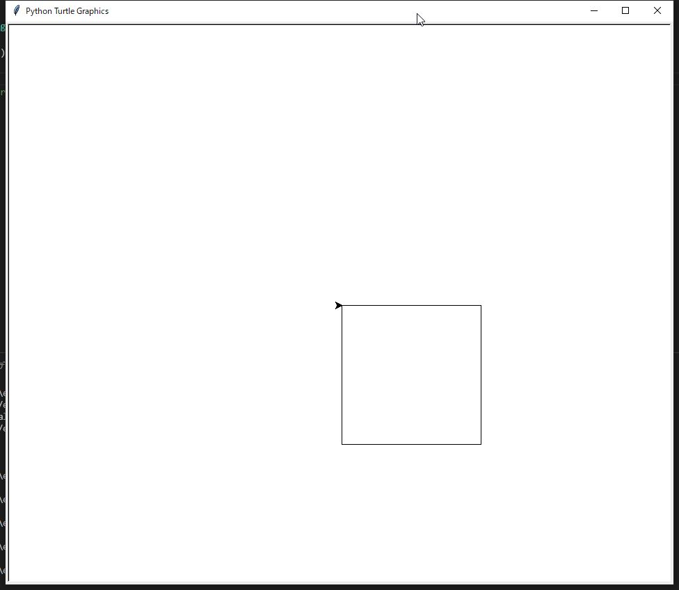
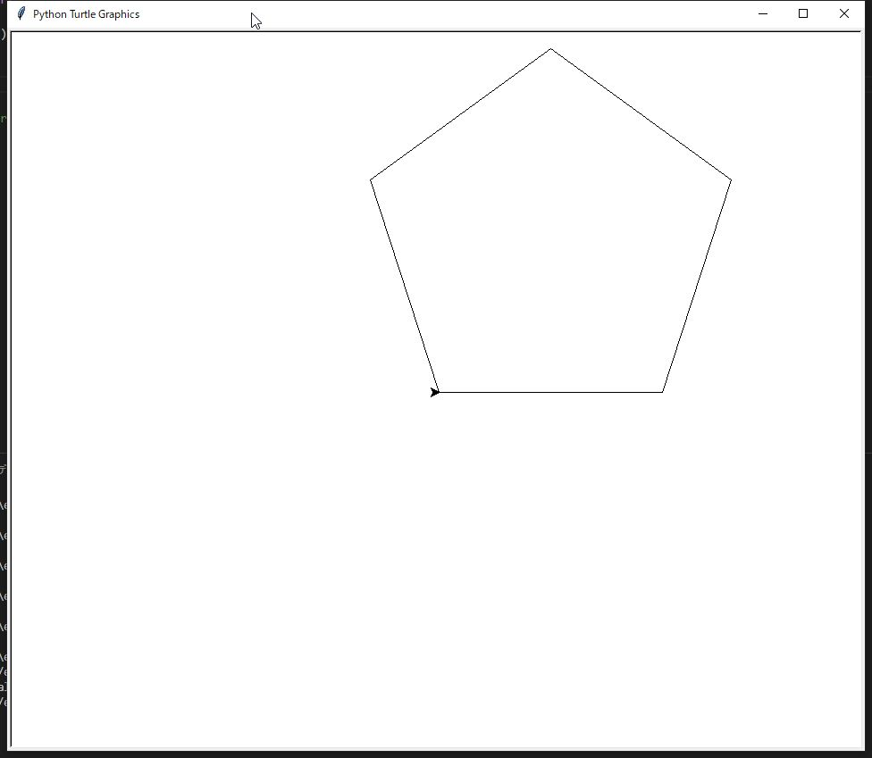
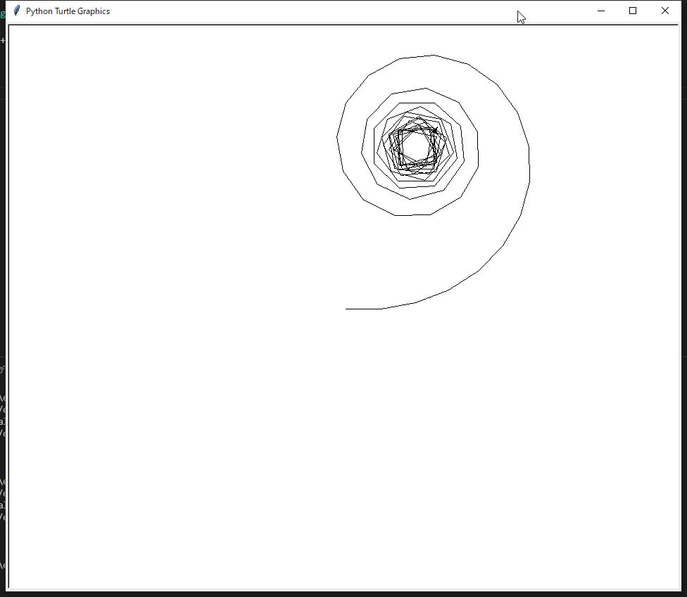
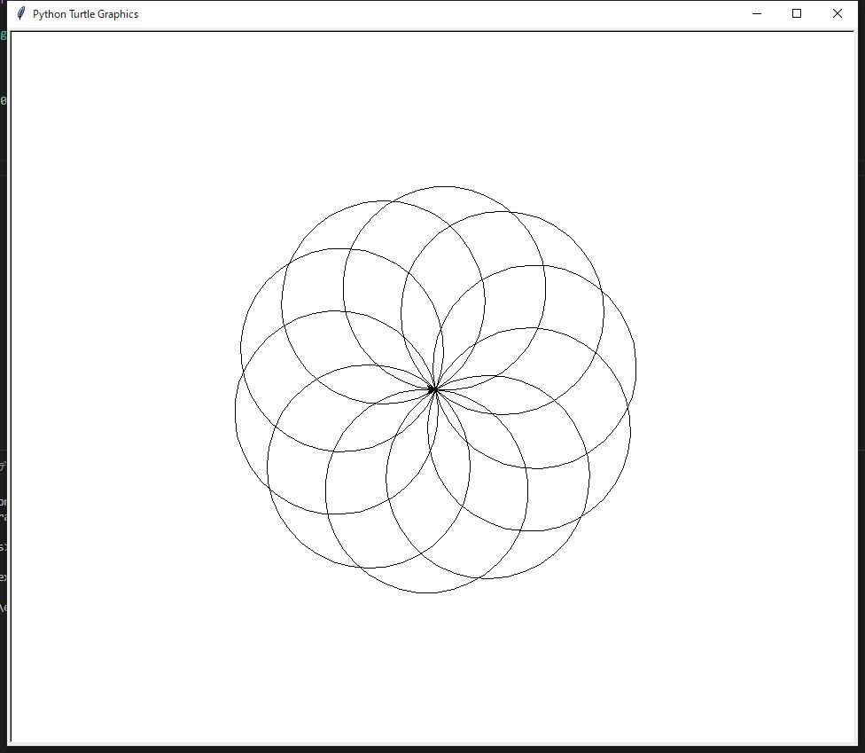
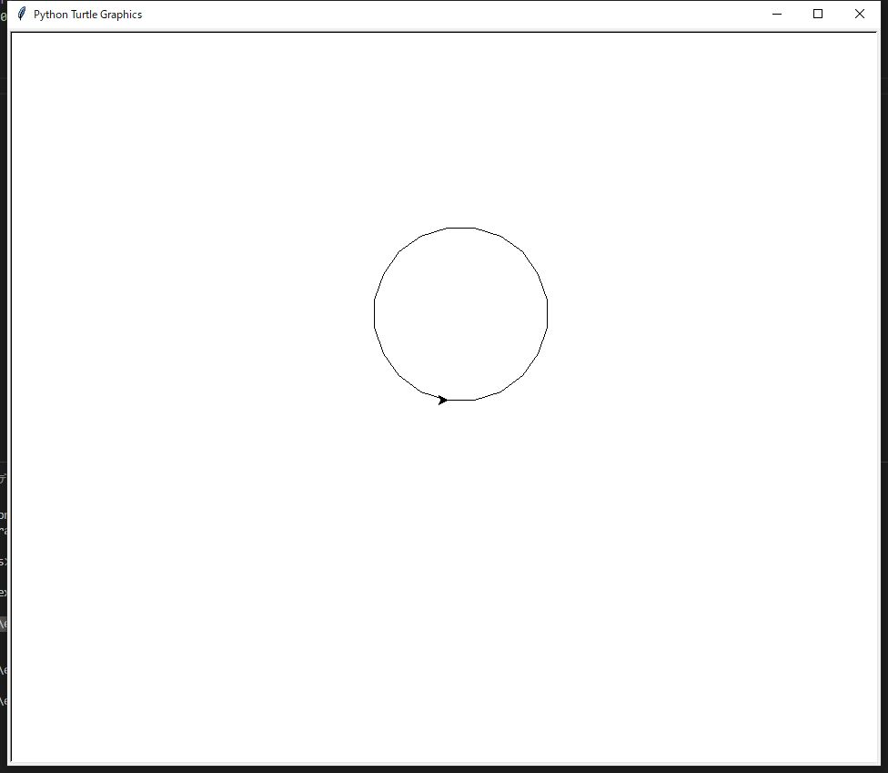

# Pythonで作ったサンプルプログラム群です。
- [Pythonで作ったサンプルプログラム群です。](#pythonで作ったサンプルプログラム群です)
  - [コマンドライン引数に指定した件数分の文字列を表示するプログラム](#コマンドライン引数に指定した件数分の文字列を表示するプログラム)
    - [内容](#内容)
    - [使い方](#使い方)
  - [九九の表を表示するプログラム](#九九の表を表示するプログラム)
    - [内容](#内容-1)
    - [使い方](#使い方-1)
  - [縦10×横10の逆三角形、三角形を表示するプログラム](#縦10横10の逆三角形三角形を表示するプログラム)
    - [内容](#内容-2)
    - [使い方](#使い方-2)
  - [+1だけで四則演算処理するプログラム](#1だけで四則演算処理するプログラム)
    - [内容](#内容-3)
    - [引数について](#引数について)
    - [演算子](#演算子)
    - [使い方](#使い方-3)
  - [占いプログラム](#占いプログラム)
    - [内容](#内容-4)
    - [使い方](#使い方-4)
  - [じゃんけんプログラム](#じゃんけんプログラム)
    - [内容](#内容-5)
    - [使い方](#使い方-5)
  - [数字を逆転して表示するプログラム](#数字を逆転して表示するプログラム)
    - [内容](#内容-6)
    - [使い方](#使い方-6)
  - [マチンの公式を使用して円周率を求めるプログラム](#マチンの公式を使用して円周率を求めるプログラム)
    - [内容](#内容-7)
    - [使い方](#使い方-7)
  - [生年月日を使用した年齢の簡易計算プログラム](#生年月日を使用した年齢の簡易計算プログラム)
    - [内容](#内容-8)
    - [使い方](#使い方-8)
  - [入力された金額に対して必要なお金の枚数を表示するプログラム](#入力された金額に対して必要なお金の枚数を表示するプログラム)
    - [内容](#内容-9)
    - [使い方](#使い方-9)
  - [100までの素数を表示するプログラム](#100までの素数を表示するプログラム)
    - [内容](#内容-10)
    - [使い方](#使い方-10)
  - [絵を描画して表示するプログラム](#絵を描画して表示するプログラム)
    - [内容](#内容-11)
    - [使い方](#使い方-11)
    - [出力結果](#出力結果)
  - [PythonからSlackにメッセージを送信するプログラム](#pythonからslackにメッセージを送信するプログラム)
    - [内容](#内容-12)
    - [使い方](#使い方-12)
    - [出力結果](#出力結果-1)

## コマンドライン引数に指定した件数分の文字列を表示するプログラム
### 内容
```md
引数に指定した件数分の文字列を表示し、指定しない場合は「引数が未入力です。」と表示するプログラム
```
### 使い方
```md
python commandline_args.py Python Ruby Java
「Python」が入力されました。
「Ruby」が入力されました。
「Java」が入力されました。
```

## 九九の表を表示するプログラム  
### 内容
```md
九九の表を表示するプログラム  
```
### 使い方
```md
python multiplication_table.py

1 | 2 | 3 | 4 | 5 | 6 | 7 | 8 | 9 | 

2 | 4 | 6 | 8 | 10 | 12 | 14 | 16 | 18 | 

3 | 6 | 9 | 12 | 15 | 18 | 21 | 24 | 27 | 

4 | 8 | 12 | 16 | 20 | 24 | 28 | 32 | 36 | 

5 | 10 | 15 | 20 | 25 | 30 | 35 | 40 | 45 | 

6 | 12 | 18 | 24 | 30 | 36 | 42 | 48 | 54 | 

7 | 14 | 21 | 28 | 35 | 42 | 49 | 56 | 63 | 

8 | 16 | 24 | 32 | 40 | 48 | 56 | 64 | 72 | 

9 | 18 | 27 | 36 | 45 | 54 | 63 | 72 | 81 | 
```

## 縦10×横10の逆三角形、三角形を表示するプログラム

### 内容
```md
縦10×横10の逆三角形、三角形を表示するプログラム
```
### 使い方
```md
python triangle_representation.py
●●●●●●●●●●●
●●●●●●●●●●
●●●●●●●●●
●●●●●●●●
●●●●●●●
●●●●●●
●●●●●
●●●●
●●●
●●
●

●
●●
●●●
●●●●
●●●●●
●●●●●●
●●●●●●●
●●●●●●●●
●●●●●●●●●
●●●●●●●●●●
●●●●●●●●●●●
```

## +1だけで四則演算処理するプログラム

### 内容
```md
+1だけで四則演算処理するプログラム
引数に指定した四則演算子と数値で計算を実施する。
指定しない場合は「引数が未入力です。」と表示する。
四則演算子以外だと「演算子(+,-,*,/)を入力してください。」と表示する。
```
### 引数について
- 第一引数：下記の四則演算子を入力
- 第二引数：計算する数値
- 第三引数：計算する数値

### 演算子
- 足し算：+
- 引き算：-
- 掛け算：*
- 割り算：/

### 使い方
```md
python commandline_args.py + 10 2
operator: +
answer: 12

python commandline_args.py - 10 2
operator: -
answer: 8

python commandline_args.py * 10 2
operator: *
answer: 20

python commandline_args.py / 10 2
operator: /
answer: 5
```

## 占いプログラム  
### 内容
```md
0～10のランダムな整数を生成する。
生成した値によって下記をコンソールに表示する。
10の場合は「大吉」
6以上10未満の場合は「中吉」
3以上6未満の場合は「吉」
1以上3未満の場合は「凶」
0の場合は「大凶」
```

### 使い方
```md
python fortune.py
10
【大吉】です。

python fortune.py
7
【中吉】です。

python fortune.py
3
【吉】です。

python fortune.py
1
【凶】です。

python fortune.py
0
【大凶】です。
```

## じゃんけんプログラム  
### 内容
```md
仕様
プログラムが起動したらずっとじゃんけんが出来る。
じゃんけんをやめる場合は下記のパラメータを入力する。
じゃんけんの出す手は下記のパラメータから入力する。
成績表示機能を作成し、下記のパラメータ入力時にプログラムが起動していた際の成績を表示する

パラメータ
1:グー、2:チョキ、3:パー、4:成績を表示、0:じゃんけん終了

判定スコアの定義
グー：0点、チョキ：1点、パー：2点
判定スコア
じゃんけんの判定スコア = [プレイヤーの手 - コンピュータの手 + 3] Mod 3
判定スコアが0の時は引き分け、1の時はプレイヤーの負け、2の時はプレイヤーの勝ち

勝ったら+1点
```
### 使い方
```md
python rock_scissors_paper.py

----------------------------
じゃんけんスタート
下記の数値を入力してください。
0:グー 1:チョキ 2:パー 3:成績を表示 4:じゃんけん終了
じゃんけんに勝ったら+1点
----------------------------
>>> 0
あなたはグーを出しました。
コンピュータはグーを出しました。
じゃんけんの結果：あいこ

----------------------------
じゃんけんスタート
下記の数値を入力してください。
0:グー 1:チョキ 2:パー 3:成績を表示 4:じゃんけん終了
じゃんけんに勝ったら+1点
----------------------------
>>> 1
あなたはチョキを出しました。
コンピュータはパーを出しました。
じゃんけんの結果：勝ち

----------------------------
じゃんけんスタート
下記の数値を入力してください。
0:グー 1:チョキ 2:パー 3:成績を表示 4:じゃんけん終了
じゃんけんに勝ったら+1点
----------------------------
>>> 2
あなたはパーを出しました。
コンピュータはパーを出しました。
じゃんけんの結果：あいこ

----------------------------
じゃんけんスタート
下記の数値を入力してください。
0:グー 1:チョキ 2:パー 3:成績を表示 4:じゃんけん終了
じゃんけんに勝ったら+1点
----------------------------
>>> 3
-----成績表-----
3 戦
スコア：1 点
勝率：33 %

----------------------------
じゃんけんスタート
下記の数値を入力してください。
0:グー 1:チョキ 2:パー 3:成績を表示 4:じゃんけん終了
じゃんけんに勝ったら+1点
----------------------------
>>> 4

```

## 数字を逆転して表示するプログラム
### 内容
```md
仕様
入力された数値を逆転して表示するプログラム

処理概要
①10で割ったあまりを利用
12345の例：
12345 / 10 = 1234...5
1234 / 10 = 123...4
123 / 10 = 12...3
12 / 10 = 1...2
1 / 10 = 0...1
余りを上から並べると、「5,4,3,2,1」になります。それを利用すると「54321」になります。

②スライスの利用
スライスを利用する場合は下記のようにかけます。
str(num)[::-1]

文字列[:] で、対象の文字全体を表します。
文字列[::-1] と書くと文字全体を後ろから1つずつスライスするので、結果として文字列が逆順に並びます。
```
### 使い方
```md
python reversing_numbers.py

数値を入力してください。>>> 12345
reverseNumber result : 54321
reverseNumberForSlice result : 54321

数値を入力してください。>>> aaaaa
数値を入力してください。
```

## マチンの公式を使用して円周率を求めるプログラム
### 内容
```md
■多倍長で円周率を計算する
Machin's formula
π/4 = 4 * Arctan(1/5) - Arctan(1/239)

引数の10を設定する理由
10 のときは 44 項の和や差を計算していることになる
そのため引数には10を指定しないといけない。
```
### 使い方
```md
python calc_pi.py 10

3.141592653589836
```
> 参考  
> https://ja.wikipedia.org/wiki/%E3%83%9E%E3%83%81%E3%83%B3%E3%81%AE%E5%85%AC%E5%BC%8F  

## 生年月日を使用した年齢の簡易計算プログラム
### 内容
```md
生年月日を使用した際の年齢計算条件
1.誕生日と年齢を計算する基準の日付を “YYYYMMDD” 形式で 8 桁の数値に変換する
2.変換した数値で { (基準の日付) – (誕生日) } ÷ 10000 を計算する
```
### 使い方
生年月日が20000101の場合
```md
python simple_age_calculation.py

あなたの生年月日を入力してください(yyyyMMdd)＞20000101
あなたの年齢は20歳です。
```

## 入力された金額に対して必要なお金の枚数を表示するプログラム
### 内容
```md
入力された数値から必要な紙幣・硬貨の枚数を出力
大きい金額から使用していく。
```
### 使い方
```md
python yen_count.py
金額を入力してください。>>> 123456789
10000円 12345枚
5000円  1枚
1000円  1枚
500円   1枚
100円   2枚
50円    1枚
10円    3枚
1円     9枚

python yen_count.py
金額を入力してください。>>> 342867
10000円 34枚
5000円  0枚
1000円  2枚
500円   1枚
100円   3枚
50円    1枚
10円    1枚
1円     7枚

python yen_count.py
金額を入力してください。>>> 4512323
10000円 451枚
5000円  0枚
1000円  2枚
500円   0枚
100円   3枚
50円    0枚
10円    2枚
1円     3枚

python yen_count.py
金額を入力してください。>>> 12314
10000円 1枚
5000円  0枚
1000円  2枚
500円   0枚
100円   3枚
50円    0枚
10円    1枚
1円     4枚

python yen_count.py
金額を入力してください。>>> aaaaa
数値を入力してください。
```
## 100までの素数を表示するプログラム
### 内容
```md
generate_prime_numbers.pyはNumPyを利用して素数を見つけるプログラム
is_prime関数で素数の判定を実施し、NumPyのvectorizeで配列の各要素ごとに判定するようにしています。

generate_prime_numbers2.pyはジェネレータを利用して素数を出力しています。

generate_prime_numbers3.pyは対象の値を2からその対象の値の手前まで割っていき、割り切れた場合は素数ではないため、それを判断対象とする。
```
### 使い方
```md
python generate_prime_numbers.py
[ 2  3  5  7 11 13 17 19 23 29 31 37 41 43 47 53 59 61 67 71 73 79 83 89 97]

python generate_prime_numbers2.py
2 3 5 7 11 13 17 19 23 29 31 37 41 43 47 53 59 61 67 71 73 79 83 89 97

python generate_prime_numbers3.py
2
3
5
7
11
13
17
19
23
29
31
37
41
43
47
53
59
61
67
71
73
79
83
89
97
```
## 絵を描画して表示するプログラム
### 内容
```md
draw_rectangle.pyは四角形を描画します。
right(90)で90度方向変換しそれを4回実施して四角形を描画しています。

draw_pentagon.pyは五角形を描画します。
left(72)で72度方向変換しそれを5回実施して五角形を描画しています。

draw_spiral.pyは渦巻を描画します。
left(10 + i)でiにはrangeで数値を渡すことによりleftの値で動きを変え渦まきを再現している。

draw_flower.pyは花を描画しています。
円を1回書き再度角度を変えて円を書く。それを10回書くことにより花を描画している。

draw_circle.pyは円を描画しています。
円を描画するためleft(18)を20回することで、360度(円)を描画しています。
```
### 使い方
```md
python draw_rectangle.py

python draw_pentagon.py

python draw_spiral.py

python draw_flower.py

python draw_circle.py
```
### 出力結果
四角形  

五角形  

渦まき  

花  

円  


## PythonからSlackにメッセージを送信するプログラム
### 内容
```md
pip install slackweb
でSlackへ送信するライブラリを取得します。
slack = slackweb.Slack(url="webhookで取得した値を設定")
上記でオブジェクトを作成し
slack.notify(text=message)
でwebhookで取得した先に送信します。
messageに出力するメッセージを記載します。
```
### 使い方
```md
pip install slackweb

python slack_python.py
```
### 出力結果
Slackの出力結果  

> 参考  
> https://qiita.com/tmiyama/items/4d1af727829c0fcd301e  
> https://jamstec-iprc.slack.com/?redir=%2Fapps%2Fnew%2FA0F7XDUAZ--incoming-webhook-  
> https://github.com/satoshi03/slack-python-webhook  
